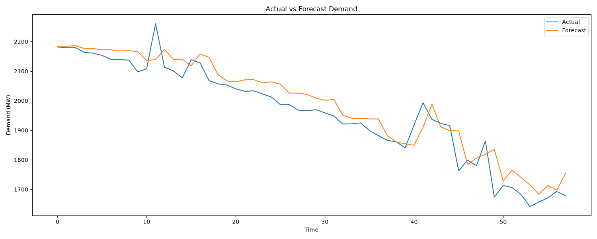
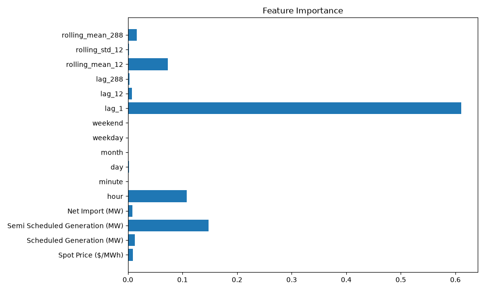
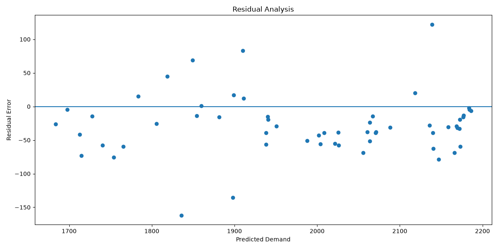
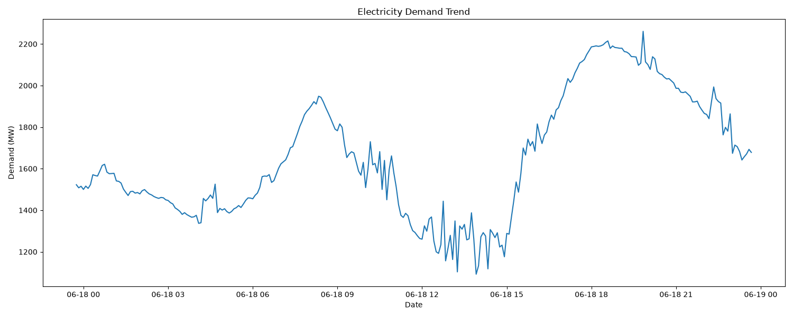

# ⚡ Energy Demand Forecaster

A machine learning project that forecasts electricity demand using time-series energy market data. The system applies feature engineering techniques such as lag features, rolling statistics, and time-based variables, and uses an XGBoost regression model for short-term demand prediction. It is designed for infrastructure planning and energy resource optimization.

---

## 📌 Project Objectives

- Forecast electricity demand using historical energy market data
- Engineer meaningful time-series features (lags, rolling averages, time features)
- Train a high-performance XGBoost regression model
- Evaluate model performance using regression metrics
- Visualize predictions and insights for analysis

---

## 📁 Folder Structure

```
Energy_demand/
│
├── data/
│ └── electricity_demand.csv
│
├── models/
│ └── xgboost_forecaster.pkl
│
├── reports/
│ ├── forecast_results.csv
│ ├── model_metrics.csv
│ └── figures/
│ ├── actual_vs_forecast.png
│ ├── feature_importance.png
│ ├── residuals.png
│ └── demand_trend.png
│
├── src/
│ ├── data_loader.py
│ ├── feature_engineering.py
│ ├── feature_pipeline.py
│ ├── model.py
│ ├── model_pipeline.py
│ ├── evaluation.py
│ ├── visualization.py
│ └── pipeline.py
│
├── tests/
│ ├── test_data_loader.py
│ ├── test_features.py
│ └── test_model.py
│
├── dashboard.py
├── main.py
├── requirements.txt
└── README.md 
```

---

## ⚙️ Installation Guide

### 1. Clone repository
```
git clone https://github.com/your-username/infrastructure-demand-forecaster.git
cd infrastructure-demand-forecaster
```
### 2. Create virtual environment

```
python -m venv venv
```
### 3. Activate Virtual Environment

#### Windows
```
venv\Scripts\activate
```
#### Mac/Linux
```
source venv/bin/activate
```
### 4. Install dependencies
```
pip install -r requirements.txt
```
## 🚀 How to Run
### Step 1: Train model
```
python main.py
```
### Step 2: Run dashboard
```
streamlit run dashboard.py
```
## 📊 Results & Visualizations
### 📈 Actual vs Forecast

### 📉 Feature Importance

### 📊 Residual Analysis

### 📈 Demand Trend


## 📏 Model Performance
| Metric | Score |
| :--- | :--- |
| **MAE** | 41.66 |
| **RMSE** | 52.19 |
| **R²** | 0.897 |
## 🧠 Techniques Used
- Time-series feature engineering
- Lag features
- Rolling statistics
- XGBoost regression
- Train/test split
- Data visualization
## 📌 Technologies
- Python
- Pandas
- NumPy
- Scikit-learn
- XGBoost
- Streamlit
- Plotly
## 👨‍💻 Author

<b>Name:</b> MD Moshiur Rahman

## 📄 License

MIT License

